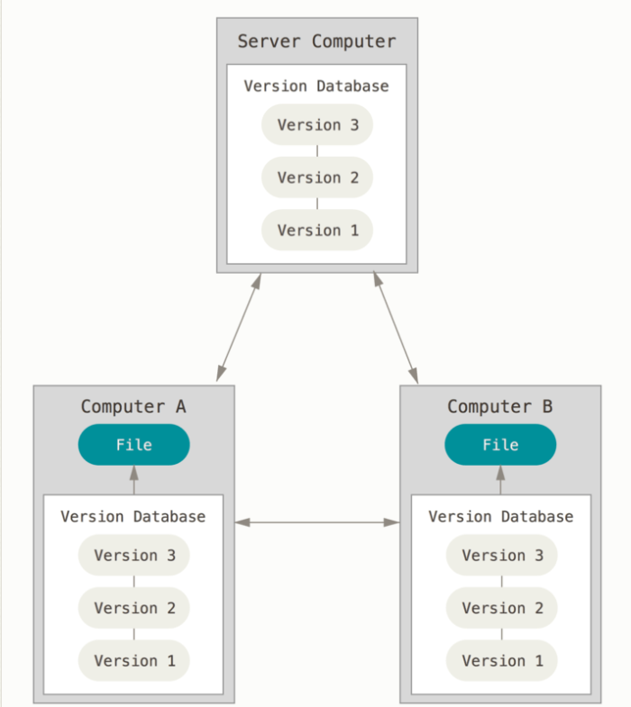
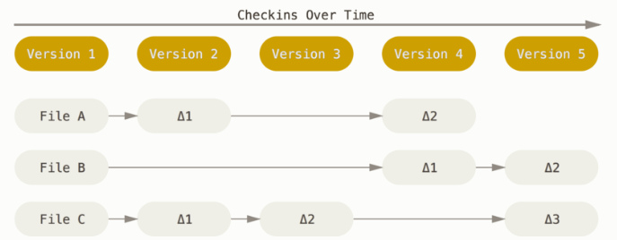

# Curso de Git y Github
## Control de versiones
Exiten dos tipos de controles de versiones, los centrales y los distribuidos
### Centralizados

Esta cuenta con grandes problemas ya que si un servidor se cae entonses durante una hora determinada nadie podra gardar los cambios de los archivos.
### Distribuidos

Aqui entra git donde los clientes no solo tienen una copia instantanea de los archivos si no si el servidor cae cualquiera de los productos de los cliente puede restaurar el que se tenia colaboratvo.
## Forma de manejo de datos
Mientras que otros controladores de versiones, las almacenan de esta manera, i.e. que por cada cambio en un archivo lo maneja como una lista de cambios de archivos atraves del tiempo .

Pero git lo hace de la sigiente manera.
Como copias instantaneas de un sistema de archivos miniatura. Cada vez que se hace un cambio, se toma una foto de todos los archivos en el momento y guarda referencia a esa copia instantanea, donde para eficientar la memora se almacena un enlace al archivo anterior en caso de que no se hayan hecho cambios .

Ademas la forma en como almacena esta informacion es atravez de hash de sus contenidos llamado Hash SHA-1 que es una cadena de 40 caracteres hexadecimales y se calcula segun el contenido del archivo o estructura del directorio de Git.
## Estados de git
En git se pueden encontrar tres estados en los que se pueden encontrar los archivos como:
- Confirmado (Committed):  significa que los datos están almacenados de manera segura en tu base de datos local.
- Modificado (Modified): significa que has modificado el archivo pero todavía no lo has confirmado a tu base de datos.
- Preparado (Staged): significa que has marcado un archivo modificado en su versión actual para que vaya en tu próxima confirmación.
## Secciones de git
El directorio de git tiene tres secciones principales:

- Directorio de git (Git directory):
El directorio de Git es donde se almacenan los metadatos y la base de datos de objetos para tu proyecto. Es la parte más importante de Git, y es lo que se copia cuando clonas un repositorio desde otra computadora.

- Directorio de trabajo (working directory):
El directorio de trabajo es una copia de una versión del proyecto. Estos archivos se sacan de la base de datos comprimida en el directorio de Git, y se colocan en disco para que los puedas usar o modificar.

- Area de trabajo (staging area):
El área de preparación es un archivo, generalmente contenido en tu directorio de Git, que almacena información acerca de lo que va a ir en tu próxima confirmación. A veces se le denomina índice (“index”), pero se está convirtiendo en estándar el referirse a ella como el área de preparación.

## Flujo de trabajo
El flujo de trabajo básico en Git es algo así:

1. Modificas una serie de archivos en tu directorio de trabajo.

1. Preparas los archivos, añadiéndolos a tu área de preparación.

1. Confirmas los cambios, lo que toma los archivos tal y como están en el área de preparación y almacena esa copia instantánea de manera permanente en tu directorio de Git.

Si una versión concreta de un archivo está en el directorio de Git, se considera confirmada (committed). Si ha sufrido cambios desde que se obtuvo del repositorio, pero ha sido añadida al área de preparación, está preparada (staged). Y si ha sufrido cambios desde que se obtuvo del repositorio, pero no se ha preparado, está modificada (modified). 
## Configuracion de git
Git trae una herramienta llamada `git config`, que te permite obtener y establecer variables de configuración que controlan el aspecto y funcionamiento de Git. Estas variables pueden almacenarse en tres sitios distintos:

Archivo `/etc/gitconfig`: Contiene valores para todos los usuarios del sistema y todos sus repositorios. Si pasas la opción `--system a git config`, lee y escribe específicamente en este archivo.

Archivo `~/.gitconfig` o `~/.config/git/config`: Este archivo es específico de tu usuario. Puedes hacer que Git lea y escriba específicamente en este archivo pasando la opción `--global`.

Archivo `config` en el directorio de Git (es decir, `.git/config`) del repositorio que estés utilizando actualmente: Este archivo es específico del repositorio actual.

Cada nivel sobrescribe los valores del nivel anterior, por lo que los valores de `.git/config` tienen preferencia sobre los de `/etc/gitconfig`.

En sistemas Windows, Git busca el archivo `.gitconfig` en el directorio `$HOME` (para mucha gente será (`C:\Users\$USER`). También busca el archivo `/etc/gitconfig`, aunque esta ruta es relativa a la raíz MSys, que es donde decidiste instalar Git en tu sistema Windows cuando ejecutaste el instalador.
### Identidad
Lo primero que deberás hacer cuando instales Git es establecer tu nombre de usuario y dirección de correo electrónico. Esto es importante porque los "commits" de Git usan esta información, y es introducida de manera inmutable en los commits que envías:
```bash
git config --global user.name "John Doe"
git config --global user.email johndoe@example.com
```
De nuevo, sólo necesitas hacer esto una vez si especificas la opción `--global`, ya que Git siempre usará esta información para todo lo que hagas en ese sistema. Si quieres sobrescribir esta información con otro nombre o dirección de correo para proyectos específicos, puedes ejecutar el comando sin la opción `--global` cuando estés en ese proyecto.

Muchas de las herramientas de interfaz gráfica te ayudarán a hacer esto la primera vez que las uses.
### Editor
Ahora que tu identidad está configurada, puedes elegir el editor de texto por defecto que se utilizará cuando Git necesite que introduzcas un mensaje. Si no indicas nada, Git usará el editor por defecto de tu sistema, que generalmente es Vim. Si quieres usar otro editor de texto como Emacs, puedes hacer lo siguiente:
```bash
git config --global core.editor emacs
```
### Comprobar configuracion
Si quieres comprobar tu configuración, puedes usar el comando `git config --list` para mostrar todas las propiedades que Git ha configurado.

Puede que veas claves repetidas, porque Git lee la misma clave de distintos archivos (/etc/gitconfig y ~/.gitconfig, por ejemplo). En estos casos, Git usa el último valor para cada clave única que ve.

También puedes comprobar el valor que Git utilizará para una clave específica ejecutando git config <key>:
```bash
$ git config user.name
John Doe
```
### Ayuda de git
Si alguna vez necesitas ayuda usando Git, existen tres formas de ver la página del manual (manpage) para cualquier comando de Git:
```bash
$ git help <verb>
$ git <verb> --help
$ man git-<verb>
```
Por ejemplo, puedes ver la página del manual para el comando config ejecutando
```bash
$ git help config
```
Estos comandos son muy útiles porque puedes acceder a ellos desde cualquier sitio, incluso sin conexión. Si las páginas del manual y este libro no son suficientes y necesitas que te ayude una persona, puedes probar en los canales #git o #github del servidor de IRC Freenode (irc.freenode.net). Estos canales están llenos de cientos de personas que conocen muy bien Git y suelen estar dispuestos a ayudar.

## Fundamentos
Si pudieras leer solo un capítulo para empezar a trabajar con Git, este es el capítulo que debes leer. Este capítulo cubre todos los comandos básicos que necesitas para hacer la gran mayoría de cosas a las que eventualmente vas a dedicar tu tiempo mientras trabajas con Git. Al final del capítulo, deberás ser capaz de configurar e inicializar un repositorio, comenzar y detener el seguimiento de archivos, y preparar (stage) y confirmar (commit) cambios. También te enseñaremos a configurar Git para que ignore ciertos archivos y patrones, cómo enmendar errores rápida y fácilmente, cómo navegar por la historia de tu proyecto y ver cambios entre confirmaciones, y cómo enviar (push) y recibir (pull) de repositorios remotos.
### Iniciando proyecto
Puedes obtener un proyecto Git de dos maneras. La primera es tomar un proyecto o directorio existente e importarlo en Git. La segunda es clonar un repositorio existente en Git desde otro servidor.
#### Existente
Si estás empezando a seguir un proyecto existente en Git, debes ir al directorio del proyecto y usar el siguiente comando:
```bash
$ git init
```
Esto crea un subdirectorio nuevo llamado .git, el cual contiene todos los archivos necesarios del repositorio – un esqueleto de un repositorio de Git. Todavía no hay nada en tu proyecto que esté bajo seguimiento. 

Si deseas empezar a controlar versiones de archivos existentes (a diferencia de un directorio vacío), probablemente deberías comenzar el seguimiento de esos archivos y hacer una confirmación inicial. Puedes conseguirlo con unos pocos comandos git add para especificar qué archivos quieres controlar, seguidos de un git commit para confirmar los cambios:
```bash
$ git add *.c
$ git add LICENSE
$ git commit -m 'initial project version'
```
#### Guardado de cambios
https://git-scm.com/book/es/v2/Fundamentos-de-Git-Guardando-cambios-en-el-Repositorio