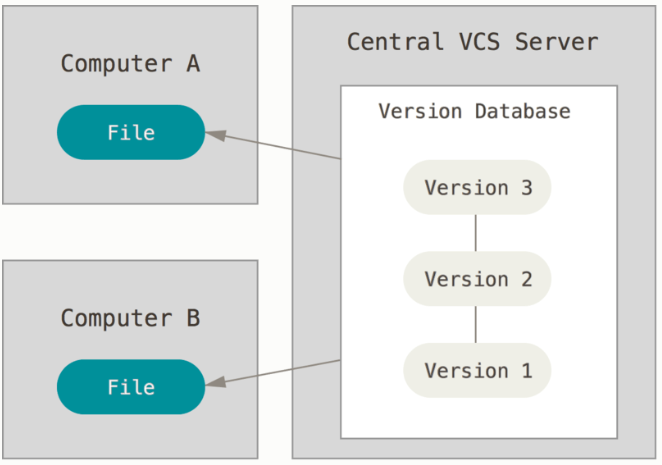
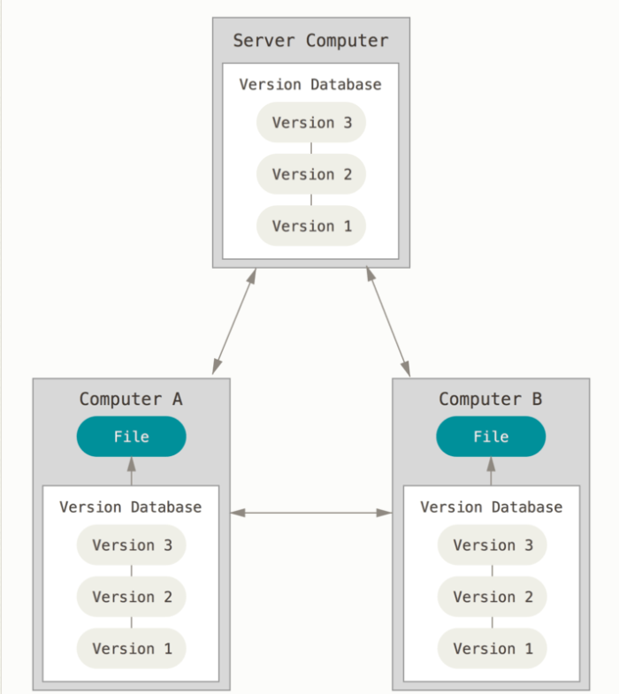
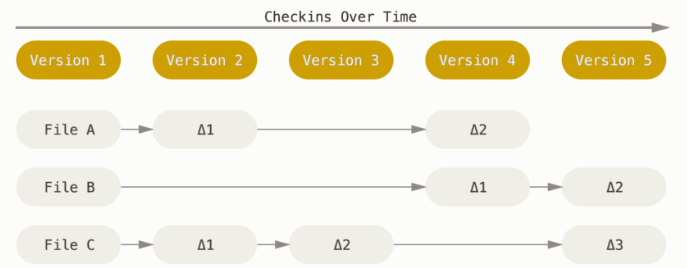
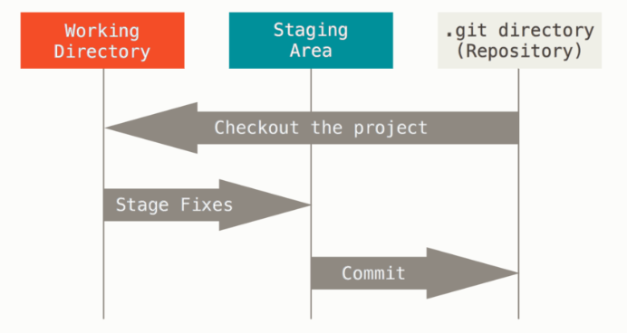
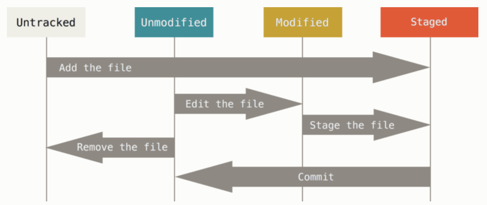

# Curso de Git y Github
## Control de versiones
Exiten dos tipos de controles de versiones, los centrales y los distribuidos
### Centralizados

Esta cuenta con grandes problemas ya que si un servidor se cae entonses durante una hora determinada nadie podra gardar los cambios de los archivos.
### Distribuidos

Aqui entra git donde los clientes no solo tienen una copia instantanea de los archivos si no si el servidor cae cualquiera de los productos de los cliente puede restaurar el que se tenia colaboratvo.
## Forma de manejo de datos
Mientras que otros controladores de versiones, las almacenan de esta manera, i.e. que por cada cambio en un archivo lo maneja como una lista de cambios de archivos atraves del tiempo .

Pero git lo hace de la sigiente manera.
Como copias instantaneas de un sistema de archivos miniatura. Cada vez que se hace un cambio, se toma una foto de todos los archivos en el momento y guarda referencia a esa copia instantanea, donde para eficientar la memora se almacena un enlace al archivo anterior en caso de que no se hayan hecho cambios .

Ademas la forma en como almacena esta informacion es atravez de hash de sus contenidos llamado Hash SHA-1 que es una cadena de 40 caracteres hexadecimales y se calcula segun el contenido del archivo o estructura del directorio de Git.
## Estados de git
En git se pueden encontrar tres estados en los que se pueden encontrar los archivos como:
- Confirmado (Committed):  significa que los datos están almacenados de manera segura en tu base de datos local.
- Modificado (Modified): significa que has modificado el archivo pero todavía no lo has confirmado a tu base de datos.
- Preparado (Staged): significa que has marcado un archivo modificado en su versión actual para que vaya en tu próxima confirmación.
## Secciones de git
El directorio de git tiene tres secciones principales:

- Directorio de git (Git directory):
El directorio de Git es donde se almacenan los metadatos y la base de datos de objetos para tu proyecto. Es la parte más importante de Git, y es lo que se copia cuando clonas un repositorio desde otra computadora.

- Directorio de trabajo (working directory):
El directorio de trabajo es una copia de una versión del proyecto. Estos archivos se sacan de la base de datos comprimida en el directorio de Git, y se colocan en disco para que los puedas usar o modificar.

- Area de trabajo (staging area):
El área de preparación es un archivo, generalmente contenido en tu directorio de Git, que almacena información acerca de lo que va a ir en tu próxima confirmación. A veces se le denomina índice (“index”), pero se está convirtiendo en estándar el referirse a ella como el área de preparación.

## Flujo de trabajo
El flujo de trabajo básico en Git es algo así:

1. Modificas una serie de archivos en tu directorio de trabajo.

1. Preparas los archivos, añadiéndolos a tu área de preparación.

1. Confirmas los cambios, lo que toma los archivos tal y como están en el área de preparación y almacena esa copia instantánea de manera permanente en tu directorio de Git.

Si una versión concreta de un archivo está en el directorio de Git, se considera confirmada (committed). Si ha sufrido cambios desde que se obtuvo del repositorio, pero ha sido añadida al área de preparación, está preparada (staged). Y si ha sufrido cambios desde que se obtuvo del repositorio, pero no se ha preparado, está modificada (modified). 
## Configuracion de git
Git trae una herramienta llamada `git config`, que te permite obtener y establecer variables de configuración que controlan el aspecto y funcionamiento de Git. Estas variables pueden almacenarse en tres sitios distintos:

Archivo `/etc/gitconfig`: Contiene valores para todos los usuarios del sistema y todos sus repositorios. Si pasas la opción `--system a git config`, lee y escribe específicamente en este archivo.

Archivo `~/.gitconfig` o `~/.config/git/config`: Este archivo es específico de tu usuario. Puedes hacer que Git lea y escriba específicamente en este archivo pasando la opción `--global`.

Archivo `config` en el directorio de Git (es decir, `.git/config`) del repositorio que estés utilizando actualmente: Este archivo es específico del repositorio actual.

Cada nivel sobrescribe los valores del nivel anterior, por lo que los valores de `.git/config` tienen preferencia sobre los de `/etc/gitconfig`.

En sistemas Windows, Git busca el archivo `.gitconfig` en el directorio `$HOME` (para mucha gente será (`C:\Users\$USER`). También busca el archivo `/etc/gitconfig`, aunque esta ruta es relativa a la raíz MSys, que es donde decidiste instalar Git en tu sistema Windows cuando ejecutaste el instalador.
### Identidad
Lo primero que deberás hacer cuando instales Git es establecer tu nombre de usuario y dirección de correo electrónico. Esto es importante porque los "commits" de Git usan esta información, y es introducida de manera inmutable en los commits que envías:
```bash
git config --global user.name "John Doe"
git config --global user.email johndoe@example.com
```
De nuevo, sólo necesitas hacer esto una vez si especificas la opción `--global`, ya que Git siempre usará esta información para todo lo que hagas en ese sistema. Si quieres sobrescribir esta información con otro nombre o dirección de correo para proyectos específicos, puedes ejecutar el comando sin la opción `--global` cuando estés en ese proyecto.

Muchas de las herramientas de interfaz gráfica te ayudarán a hacer esto la primera vez que las uses.
### Editor
Ahora que tu identidad está configurada, puedes elegir el editor de texto por defecto que se utilizará cuando Git necesite que introduzcas un mensaje. Si no indicas nada, Git usará el editor por defecto de tu sistema, que generalmente es Vim. Si quieres usar otro editor de texto como Emacs, puedes hacer lo siguiente:
```bash
git config --global core.editor emacs
```
### Comprobar configuracion
Si quieres comprobar tu configuración, puedes usar el comando `git config --list` para mostrar todas las propiedades que Git ha configurado.

Puede que veas claves repetidas, porque Git lee la misma clave de distintos archivos (/etc/gitconfig y ~/.gitconfig, por ejemplo). En estos casos, Git usa el último valor para cada clave única que ve.

También puedes comprobar el valor que Git utilizará para una clave específica ejecutando git config <key>:
```bash
$ git config user.name
John Doe
```
### Ayuda de git
Si alguna vez necesitas ayuda usando Git, existen tres formas de ver la página del manual (manpage) para cualquier comando de Git:
```bash
$ git help <verb>
$ git <verb> --help
$ man git-<verb>
```
Por ejemplo, puedes ver la página del manual para el comando config ejecutando
```bash
$ git help config
```
Estos comandos son muy útiles porque puedes acceder a ellos desde cualquier sitio, incluso sin conexión. Si las páginas del manual y este libro no son suficientes y necesitas que te ayude una persona, puedes probar en los canales #git o #github del servidor de IRC Freenode (irc.freenode.net). Estos canales están llenos de cientos de personas que conocen muy bien Git y suelen estar dispuestos a ayudar.

## Fundamentos
Si pudieras leer solo un capítulo para empezar a trabajar con Git, este es el capítulo que debes leer. Este capítulo cubre todos los comandos básicos que necesitas para hacer la gran mayoría de cosas a las que eventualmente vas a dedicar tu tiempo mientras trabajas con Git. Al final del capítulo, deberás ser capaz de configurar e inicializar un repositorio, comenzar y detener el seguimiento de archivos, y preparar (stage) y confirmar (commit) cambios. También te enseñaremos a configurar Git para que ignore ciertos archivos y patrones, cómo enmendar errores rápida y fácilmente, cómo navegar por la historia de tu proyecto y ver cambios entre confirmaciones, y cómo enviar (push) y recibir (pull) de repositorios remotos.
### Iniciando proyecto
Puedes obtener un proyecto Git de dos maneras. La primera es tomar un proyecto o directorio existente e importarlo en Git. La segunda es clonar un repositorio existente en Git desde otro servidor.
#### Existente
Si estás empezando a seguir un proyecto existente en Git, debes ir al directorio del proyecto y usar el siguiente comando:
```bash
$ git init
```
Esto crea un subdirectorio nuevo llamado .git, el cual contiene todos los archivos necesarios del repositorio – un esqueleto de un repositorio de Git. Todavía no hay nada en tu proyecto que esté bajo seguimiento. 

Si deseas empezar a controlar versiones de archivos existentes (a diferencia de un directorio vacío), probablemente deberías comenzar el seguimiento de esos archivos y hacer una confirmación inicial. Puedes conseguirlo con unos pocos comandos git add para especificar qué archivos quieres controlar, seguidos de un git commit para confirmar los cambios:
```bash
$ git add *.c
$ git add LICENSE
$ git commit -m 'initial project version'
```
#### Guardado de cambios
Recuerda que cada archivo de tu repositorio puede tener dos estados: rastreados y sin rastrear. Los archivos rastreados (tracked files en inglés) son todos aquellos archivos que estaban en la última instantánea del proyecto; pueden ser archivos sin modificar, modificados o preparados. Los archivos sin rastrear son todos los demás - cualquier otro archivo en tu directorio de trabajo que no estaba en tu última instantánea y que no está en el área de preparación (staging area). Cuando clonas por primera vez un repositorio, todos tus archivos estarán rastreados y sin modificar pues acabas de sacarlos y aun no han sido editados.

Mientras editas archivos, Git los ve como modificados, pues han sido cambiados desde su último commit. Luego preparas estos archivos modificados y finalmente confirmas todos los cambios preparados, y repites el ciclo.



```bash
 ~  git status
On branch prueba
Your branch is up to date with 'origin/prueba'.

Changes not staged for commit:
  (use "git add <file>..." to update what will be committed)
  (use "git restore <file>..." to discard changes in working directory)
        modified:   README.md

Untracked files:
  (use "git add <file>..." to include in what will be committed)
        image-5.png

no changes added to commit (use "git add" and/or "git commit -a")
```
```bash
$ git status
On branch master
nothing to commit, working directory clean
```
Esto significa que tienes un directorio de trabajo limpio - en otras palabras, que no hay archivos rastreados y modificados. Además, Git no encuentra archivos sin rastrear, de lo contrario aparecerían listados aquí. Finalmente, el comando te indica en cuál rama estás y te informa que no ha variado con respecto a la misma rama en el servidor. Por ahora, la rama siempre será “master”, que es la rama por defecto; no le prestaremos atención de momento.

Supongamos que añades un nuevo archivo a tu proyecto, un simple texto. Si el archivo no existía antes y ejecutas git status, verás el archivo sin rastrear de la siguiente manera:

```bash
git status
On branch prueba
Your branch is ahead of 'origin/prueba' by 1 commit.
  (use "git push" to publish your local commits)

Untracked files:
  (use "git add <file>..." to include in what will be committed)
        texto.txt

nothing added to commit but untracked files present (use "git add" to track)
```
##### Rastrear Archivos Nuevos
Puedes ver que el archivo texto está sin rastrear porque aparece debajo del encabezado “Untracked files” (“Archivos no rastreados” en inglés) en la salida. Sin rastrear significa que Git ve archivos que no tenías en el commit anterior. Git no los incluirá en tu próximo commit a menos que se lo indiques explícitamente. Se comporta así para evitar incluir accidentalmente archivos binarios o cualquier otro archivo que no quieras incluir. Como tú sí quieres incluir texto, debes comenzar a rastrearlo.
```bash
~  git add texto.txt 
~  git status
On branch prueba
Your branch is ahead of 'origin/prueba' by 1 commit.
  (use "git push" to publish your local commits)

Changes to be committed:
  (use "git restore --staged <file>..." to unstage)
        new file:   texto.txt

Changes not staged for commit:
  (use "git add <file>..." to update what will be committed)
  (use "git restore <file>..." to discard changes in working directory)
        modified:   README.md
```
Puedes ver que está siendo rastreado porque aparece luego del encabezado “Cambios a ser confirmados” (“Changes to be committed” en inglés). Si confirmas en este punto, se guardará en el historial la versión del archivo correspondiente al instante en que ejecutaste git add. Anteriormente cuando ejecutaste git init, ejecutaste luego git add (files) - lo cual inició el rastreo de archivos en tu directorio. El comando git add puede recibir tanto una ruta de archivo como de un directorio; si es de un directorio, el comando añade recursivamente los archivos que están dentro de él.

##### Preparar Archivos Modificados
Vamos a cambiar un archivo que esté rastreado. Si cambias el archivo rastreado llamado “CONTRIBUTING.md” y luego ejecutas el comando git status, verás algo parecido a esto:
```bash
~  git status
On branch prueba
Your branch is ahead of 'origin/prueba' by 1 commit.
  (use "git push" to publish your local commits)

Changes to be committed:
  (use "git restore --staged <file>..." to unstage)
        new file:   texto.txt

Changes not staged for commit:
  (use "git add <file>..." to update what will be committed)
  (use "git restore <file>..." to discard changes in working directory)
        modified:   README.md
```
El archivo “CONTRIBUTING.md” aparece en una sección llamada “Changes not staged for commit” (“Cambios no preparado para confirmar” en inglés) - lo que significa que existe un archivo rastreado que ha sido modificado en el directorio de trabajo pero que aún no está preparado. Para prepararlo, ejecutas el comando git add. git add es un comando que cumple varios propósitos - lo usas para empezar a rastrear archivos nuevos, preparar archivos, y hacer otras cosas como marcar archivos en conflicto por combinación como resueltos. Es más útil que lo veas como un comando para “añadir este contenido a la próxima confirmación” más que para “añadir este archivo al proyecto”. Ejecutemos git add para preparar el archivo “CONTRIBUTING.md” y luego ejecutemos git status:

```bash
~  git status
On branch prueba
Your branch is ahead of 'origin/prueba' by 1 commit.
  (use "git push" to publish your local commits)

Changes to be committed:
  (use "git restore --staged <file>..." to unstage)
        modified:   README.md
        new file:   texto.txt
```
Ambos archivos están preparados y formarán parte de tu próxima confirmación. En este momento, supongamos que recuerdas que debes hacer un pequeño cambio en CONTRIBUTING.md antes de confirmarlo. Abres de nuevo el archivo, lo cambias y ahora estás listos para confirmar. Sin embargo, ejecutemos git status una vez más:
```bash
 ~  git status
On branch prueba
Your branch is ahead of 'origin/prueba' by 1 commit.
  (use "git push" to publish your local commits)

Changes to be committed:
  (use "git restore --staged <file>..." to unstage)
        modified:   README.md
        new file:   texto.txt

Changes not staged for commit:
  (use "git add <file>..." to update what will be committed)
  (use "git restore <file>..." to discard changes in working directory)
        modified:   README.md
```
¡¿Pero qué…​?! Ahora CONTRIBUTING.md aparece como preparado y como no preparado. ¿Cómo es posible? Resulta que Git prepara un archivo de acuerdo al estado que tenía cuando ejecutas el comando git add. Si confirmas ahora, se confirmará la versión de CONTRIBUTING.md que tenías la última vez que ejecutaste git add y no la versión que ves ahora en tu directorio de trabajo al ejecutar git status. Si modificas un archivo luego de ejecutar git add, deberás ejecutar git add de nuevo para preparar la última versión del archivo:
```bash
~  git status
On branch prueba
Your branch is ahead of 'origin/prueba' by 1 commit.
  (use "git push" to publish your local commits)

Changes to be committed:
  (use "git restore --staged <file>..." to unstage)
        modified:   README.md
        new file:   texto.txt
```
##### Estado Abreviado
Si bien es cierto que la salida de git status es bastante explícita, también es verdad que es muy extensa. Git ofrece una opción para obtener un estado abreviado, de manera que puedas ver tus cambios de una forma más compacta. Si ejecutas git status -s o git status --short, obtendrás una salida mucho más simplificada.
```bash
 ~  git status -s
MM README.md
A  texto.txt


$ git status -s
 M README
MM Rakefile
A  lib/git.rb
M  lib/simplegit.rb
?? LICENSE.txt
```
Los archivos nuevos que no están rastreados tienen un ?? a su lado, los archivos que están preparados tienen una A y los modificados una M. El estado aparece en dos columnas - la columna de la izquierda indica el estado preparado y la columna de la derecha indica el estado sin preparar. Por ejemplo, en esa salida, el archivo README está modificado en el directorio de trabajo pero no está preparado, mientras que lib/simplegit.rb está modificado y preparado. El archivo Rakefile fue modificado, preparado y modificado otra vez por lo que existen cambios preparados y sin preparar.

##### Ignorar Archivos
A veces, tendrás algún tipo de archivo que no quieres que Git añada automáticamente o más aun, que ni siquiera quieras que aparezca como no rastreado. Este suele ser el caso de archivos generados automáticamente como trazas o archivos creados por tu sistema de compilación. En estos casos, puedes crear un archivo llamado .gitignore que liste patrones a considerar. Este es un ejemplo de un archivo .gitignore:
```bash
cat .gitignore
*.[oa]
*~
```
La primera línea le indica a Git que ignore cualquier archivo que termine en “.o” o “.a” - archivos de objeto o librerías que pueden ser producto de compilar tu código. La segunda línea le indica a Git que ignore todos los archivos que terminen con una tilde (~), la cual es usada por varios editores de texto como Emacs para marcar archivos temporales. También puedes incluir cosas como trazas, temporales, o pid directamente; documentación generada automáticamente; etc. Crear un archivo .gitignore antes de comenzar a trabajar es generalmente una buena idea, pues así evitas confirmar accidentalmente archivos que en realidad no quieres incluir en tu repositorio Git.

Las reglas sobre los patrones que puedes incluir en el archivo .gitignore son las siguientes:

Ignorar las líneas en blanco y aquellas que comiencen con #.

Emplear patrones glob estándar que se aplicarán recursivamente a todo el directorio del repositorio local.

Los patrones pueden comenzar en barra (/) para evitar recursividad.

Los patrones pueden terminar en barra (/) para especificar un directorio.

Los patrones pueden negarse si se añade al principio el signo de exclamación (!).

Los patrones glob son una especie de expresión regular simplificada usada por los terminales. Un asterisco (*) corresponde a cero o más caracteres; [abc] corresponde a cualquier caracter dentro de los corchetes (en este caso a, b o c); el signo de interrogación (?) corresponde a un caracter cualquiera; y los corchetes sobre caracteres separados por un guión ([0-9]) corresponde a cualquier caracter entre ellos (en este caso del 0 al 9). También puedes usar dos asteriscos para indicar directorios anidados; a/**/z coincide con a/z, a/b/z, a/b/c/z, etc.

Aquí puedes ver otro ejemplo de un archivo .gitignore:
```txt
# ignora los archivos terminados en .a
*.a

# pero no lib.a, aun cuando había ignorado los archivos terminados en .a en la línea anterior
!lib.a

# ignora unicamente el archivo TODO de la raiz, no subdir/TODO
/TODO

# ignora todos los archivos del directorio build/
build/

# ignora doc/notes.txt, pero no este: doc/server/arch.txt
doc/*.txt

# ignora todos los archivos .txt del directorio doc/
doc/**/*.txt
```
##### Ver los Cambios Preparados y No Preparados
Si el comando git status es muy impreciso para ti - quieres ver exactamente que ha cambiado, no solo cuáles archivos lo han hecho - puedes usar el comando git diff. Hablaremos sobre git diff más adelante, pero lo usarás probablemente para responder estas dos preguntas: ¿Qué has cambiado pero aun no has preparado? y ¿Qué has preparado y está listo para confirmar? A pesar de que git status responde a estas preguntas de forma muy general listando el nombre de los archivos, git diff te muestra las líneas exactas que fueron añadidas y eliminadas, es decir, el parche.

Supongamos que editas y preparas el archivo README de nuevo y luego editas CONTRIBUTING.md pero no lo preparas. Si ejecutas el comando git status, verás algo como esto:
```bash
 ~  git status
On branch prueba
Your branch is ahead of 'origin/prueba' by 1 commit.
  (use "git push" to publish your local commits)

Changes to be committed:
  (use "git restore --staged <file>..." to unstage)
        modified:   README.md
        new file:   texto.txt

Changes not staged for commit:
  (use "git add <file>..." to update what will be committed)
  (use "git restore <file>..." to discard changes in working directory)
        modified:   README.md
```
Para ver qué has cambiado pero aun no has preparado, escribe git diff sin más parámetros:
```bash
 ~  git diff
diff --git a/README.md b/README.md
index c70510c..1a54286 100644
--- a/README.md
+++ b/README.md
@@ -219,3 +219,95 @@ Changes not staged for commit:
         modified:   README.md
 ```
 ¡¿Pero qué…​?! Ahora CONTRIBUTING.md aparece como preparado y como no preparado. ¿Cómo es posible? Resulta que Git prepara un archivo de acuerdo al estado que tenía cuando ejecutas el comando git add. Si confirmas ahora, se confirmará la versión de CONTRIBUTING.md que tenías la última vez que ejecutaste git add y no la versión que ves ahora en tu directorio de trabajo al ejecutar git status. Si modificas un archivo luego de ejecutar git add, deberás ejecutar git add de nuevo para preparar la última versión del archivo:
+```bash
+~  git status
+On branch prueba
+Your branch is ahead of 'origin/prueba' by 1 commit.
+  (use "git push" to publish your local commits)
+
+Changes to be committed:
+  (use "git restore --staged <file>..." to unstage)
+        modified:   README.md
+        new file:   texto.txt
+```
+##### Estado Abreviado
+Si bien es cierto que la salida de git status es bastante explícita, también es verdad que es muy extensa. Git ofrece una opción para obtener un estado abreviado, de manera que puedas ver tus cambios de una forma más compacta. Si ejecutas git status -s o git status --short, obtendrás una salida mucho más simplificada.
+```bash
+ ~  git status -s
:
```
Este comando compara lo que tienes en tu directorio de trabajo con lo que está en el área de preparación. El resultado te indica los cambios que has hecho pero que aun no has preparado.

Si quieres ver lo que has preparado y será incluido en la próxima confirmación, puedes usar git diff --staged. Este comando compara tus cambios preparados con la última instantánea confirmada.
```bash
 ~  git diff --staged
diff --git a/README.md b/README.md
index 25eb4a6..8cd6793 100644
--- a/README.md
+++ b/README.md
@@ -337,4 +337,7 @@ index c70510c..1a54286 100644
 +```bash
 + ~  git status -s
 :
-```
\ No newline at end of file
+```
+Este comando compara lo que tienes en tu directorio de trabajo con lo que está en el área de preparación. El resultado te indica los cambios que has hecho pero que aun no has preparado.
+
+Si quieres ver lo que has preparado y será incluido en la próxima confirmación, puedes usar git diff --staged. Este comando compara tus cambios preparados con la última instantánea confirmada.
\ No newline at end of file
```
Es importante resaltar que al llamar a git diff sin parámetros no verás los cambios desde tu última confirmación - solo verás los cambios que aun no están preparados. Esto puede ser confuso porque si preparas todos tus cambios, git diff no te devolverá ninguna salida.

Pasemos a otro ejemplo, si preparas el archivo CONTRIBUTING.md y luego lo editas, puedes usar git diff para ver los cambios en el archivo que ya están preparados y los cambios que no lo están. Si nuestro ambiente es como este:

```bash
$ git add CONTRIBUTING.md
$ echo 'test line' >> CONTRIBUTING.md
$ git status
On branch master
Changes to be committed:
  (use "git reset HEAD <file>..." to unstage)

    modified:   CONTRIBUTING.md

Changes not staged for commit:
  (use "git add <file>..." to update what will be committed)
  (use "git checkout -- <file>..." to discard changes in working directory)

    modified:   CONTRIBUTING.md
```
Puedes usar git diff para ver qué está sin preparar
```bash
~  git diff
diff --git a/README.md b/README.md
index 8cd6793..7f1c8b3 100644
--- a/README.md
+++ b/README.md
@@ -340,4 +340,43 @@ index c70510c..1a54286 100644
 ```
 Este comando compara lo que tienes en tu directorio de trabajo con lo que está en el área de preparación. El resultado te indica los cambios que has hecho pero que aun no has preparado.
 
-Si quieres ver lo que has preparado y será incluido en la próxima confirmación, puedes usar git diff --staged. Este comando compara tus cambios preparados con la última instantánea confirmada.
\ No newline at end of file
+Si quieres ver lo que has preparado y será incluido en la próxima confirmación, puedes usar git diff --staged. Este comando compara tus cambios preparados con la última instantánea confirmada.
+```bash
+ ~  git diff --staged
+diff --git a/README.md b/README.md
+index 25eb4a6..8cd6793 100644
+--- a/README.md
++++ b/README.md
+@@ -337,4 +337,7 @@ index c70510c..1a54286 100644
+ +```bash
+ + ~  git status -s
+ :
+-```
+\ No newline at end of file
++```
++Este comando compara lo que tienes en tu directorio de trabajo con lo que está en el área de preparación. El resultado te indica los cambios que has hecho pero que aun no has preparado.
:
```
y git diff --cached para ver que has preparado hasta ahora (--staged y --cached son sinónimos):
```bash
 ~  git diff --cached
diff --git a/README.md b/README.md
index 25eb4a6..8cd6793 100644
--- a/README.md
+++ b/README.md
@@ -337,4 +337,7 @@ index c70510c..1a54286 100644
 +```bash
 + ~  git status -s
 :
-```
\ No newline at end of file
+```
+Este comando compara lo que tienes en tu directorio de trabajo con lo que está en el área de preparación. El resultado te indica los cambios que has hecho pero que aun no has preparado.
+
+Si quieres ver lo que has preparado y será incluido en la próxima confirmación, puedes usar git diff --staged. Este comando compara tus cambios preparados con la última instantánea confirmada.
\ No newline at end of file
```
Git Diff como Herramienta Externa
A lo largo del libro, continuaremos usando el comando git diff de distintas maneras. Existe otra forma de ver estas diferencias si prefieres utilizar una interfaz gráfica u otro programa externo. Si ejecutas git difftool en vez de git diff, podrás ver los cambios con programas de este tipo como Araxis, emerge, vimdiff y más. Ejecuta git difftool --tool-help para ver qué tienes disponible en tu sistema.

##### Confirmar tus Cambios
Ahora que tu área de preparación está como quieres, puedes confirmar tus cambios. Recuerda que cualquier cosa que no esté preparada - cualquier archivo que hayas creado o modificado y que no hayas agregado con git add desde su edición - no será confirmado. Se mantendrán como archivos modificados en tu disco. En este caso, digamos que la última vez que ejecutaste git status verificaste que todo estaba preparado y que estás listo para confirmar tus cambios. La forma más sencilla de confirmar es escribiendo git commit:
```bash
git commit
```
Al hacerlo, arrancará el editor de tu preferencia. (El editor se establece a través de la variable de ambiente $EDITOR de tu terminal - usualmente es vim o emacs, aunque puedes configurarlo con el editor que quieras usando el comando git config --global core.editor)
El editor mostrará el siguiente texto (este ejemplo corresponde a una pantalla de Vim):
```vim
# Please enter the commit message for your changes. Lines starting
# with '#' will be ignored, and an empty message aborts the commit.
# On branch master
# Changes to be committed:
#	new file:   README
#	modified:   CONTRIBUTING.md
#
~
~
~
".git/COMMIT_EDITMSG" 9L, 283C
```
